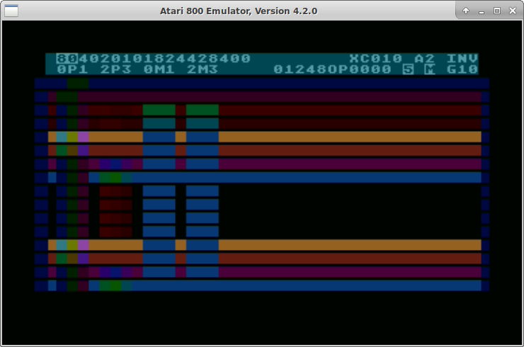
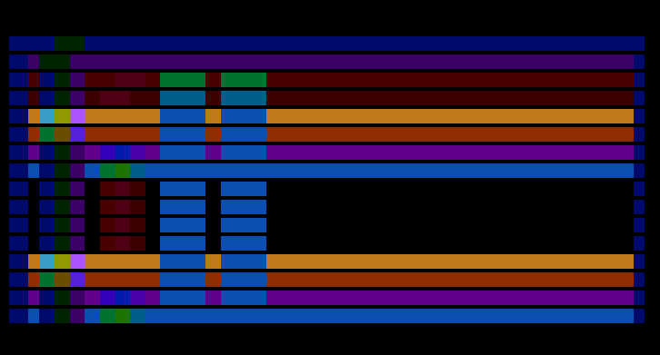
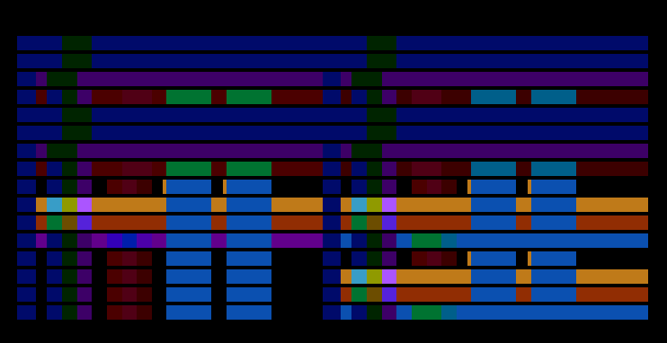

# 22 kolory w linii

Standartowy tryb [GR.10 BASIC-a](http://atariki.krap.pl/index.php/Graphics_10) pozwala na wykorzystanie 9 kolorów w linii kosztem zmniejszenia rozdzielczości do 80 pikseli w poziomie.

Włączenie tego trybu realizowane jest tak, że konstruowana jest [Display List](http://atariki.krap.pl/index.php/ANTIC_Display_List) jak dla trybu GR.8 (hires) po czym w rejestrze GTIACTL ustawiany jest tryb %10 GTIA. Tyle umożliwia system operacyjny z BASIC-em.

Zamiast trybu GR.8 można użyć trybu tekstowego (też hires) czyli GR.0 i nałożyć na niego tryb GTIA. To samo można zrobić z dowolnym innym trybem graficznym ANTIC-a. Dodatkowo można również włączyć sprajty i używać ich na ekranie.

W trybie 9-kolorowym jednak niewielki z tego zysk, ponieważ kolory pikseli 0-3 trybu graficznego brane są z tych samych rejestrów co kolory sprajtów COLPM0-3. Kolory pikseli 4-7 są brane z rejestrów COLPF0-3, a kolor piksela 8 z rejestru COLBAK. Można za to dostać dodatkowe 2 kolory włączając [tryb nakładania sprajtów](http://atariki.krap.pl/index.php/Rejestry_GTIA#GTIACTL) w rejestrze GTIACTL. Sprajty nakładane są wtedy parami - zapalone piksele PM0 i PM1 pokrywające się dają dodatkowy kolor powstały z wykonania operacji bitowego OR na wartości rejestrów kolorów COLPM0 i COLPM1. Analogicznie rzecz się ma z pikselami sprajtów PM2 i PM3. No ale to dopiero 11 kolorów - za resztę odpowiada "zabroniony" zerowy priorytet sprajtów ustalany również w rejestrze GTIACTL.

Według ustaleń **Jose Pereiry** [w wątku na AtariAge](https://atariage.com/forums/topic/295004-priority_0-explanation/) okazuje się, że sprajty interferują wtedy z pikselami grafiki dając dodatkowe kolory - cytując:

>Priority_0 gives OR(ings) on PMGs over certain PFs colours so works like this (using charmodes Antic4 and/or 5):

>-> PM0 over BAK = PM0 colour;
>" " PF0 = PM0 OR PF0 colour;
>" " PF1 = PM1 OR PF1 colour;
>-> PM1 over BAK = PM1 colour;
>" " PF0 = PM1 OR PF0 colour;
>" " PF1 = PM1 OR PF1 colour;
>-> PM2 over BAK = PM2 colour;
>" " PF2 = PM2 OR PF2 colour;
>" " PF3 = PM2 OR PF3 colour;
>-> PM3 over BAK = PM3 colour;
>" " PF2 = PM3 OR PF2 colour;
>" " PF3 = PM3 OR PF3 colour;

>This way you can have this 12colours more the 5 (BAK/PF0/PF1/PF2/PF3) makes 17colours per scanline possible.

>If you take of the M (Missiles off) and use only P (Players) is still the same but the mIssiles acts as the 'so called' 5th Player and take PF3 colour. This way the Missiles themselves doesn't OR anything but if P2 or P3 goes over them it'll OR them because they're be considered as PF3 colour.

>On Mode D and E bitmap modes this same thing happens but you don't have PF3 but you can still OR it if you have the Missiles as 5th Player and P2/P3 OR them.

>Also if you go to PMGs multicolour mode that is PM0 OR PM1 and PM2 OR PM3 to above you'll have to add:

>-> PM0 OR PM1 over BAK: PM0 OR PM1 colour;
>" " PF0: (PM0 OR PM1) OR PF0 colour;
>" " PF1: (PM0 OR PM1) OR PF1 colour;
>-> PM2 OR PM3 over BAK: PM2 OR PM3 colour;
>" " PF2: (PM2 OR PM3) OR PF2 colour;
>" " PF3: (PM2 OR PM3) OR PF3 colour;

>This way to 17colours above we'll add more 6colours and that is why you may have read that A8 can display maximum of 23colours per scanline.

A więc dodatkowe kolory uzyskuje się nie tylko z nałożenia pikseli sprajtów na piksele trybu graficznego, ale również już uprzednio nałożonych sprajtów np. PM0 i PM1 oraz PF0.

Zrobiłem prosty programik [anticgtiatest.obx](./anticgtiatest.obx) do eksperymentowania z trybami GTIA i tekstowymi trybami ANTIC2 (GR.0) i ANTIC4 (GR.12).

Na ekranie mamy w pierwszej linii:

- rejestry kolorów w kolejności COLPM0-3, COLPF0-3 i COLBAK,
- XC - zawartość rejestru [CHACTL](http://atariki.krap.pl/index.php/Rejestry_ANTIC-a#CHRCTL),
- Ax - tryb ANTIC-a,
- Inv - inwersja zawartości pamięci ekranu

W drugiej zaś:

- 0P1 2P3 0M1 2M3 - to znaczniki w których kolumnach na grafikę są nakładane sprajty; zorganizowane to jest tak, że sprajt wyświetlany jest przez całą wysokość ekranu przy czym w miejscu 0P1 w kolumnie 0 wyświetlany jest piksel Player0, tam gdzie 1 - Player1, tam gdzie P - nałożony Player0 i Player1; analogicznie dla 2P3, 0M1 i 2M3.
- 01248OP - [priorytet PMG](http://atariki.krap.pl/index.php/Rejestry_GTIA#GTIACTL)
- 5 - włączenie Player5
- M - włączenie nakładania sprajtów
- Gxx - tryb GTIA

Poniżej znajduje się 16 wierszy zawierających piksele o kolejnych indeksach kolorów - wiersz pierwszy to wyłącznie piksele 0, drugi - 1, trzeci - 2 i tak aż do F. Uzyskałem w ten sposób matrycę, która pozwala obserwować interakcje pikseli trybu graficznego (wiersze) z pikselami sprajtów (kolumny).

Klawiszologia jest w zasadzie opisana na ekranie:

- kursory i kursory z ctrl - zmiana wartości rejestru koloru
- XC - zmiana CHACTL
- A - zmiana trybu ANTIC
- Inverse - inwersja pamięci ekranu
- 01248OP - zmiana priorytetu
- 5 - przełączenie Player5
- M - przełączenie nakładania sprajtów
- G - zmiana trybu GTIA

W drodze eksperymentu okazało się, że da się w ten sposób na ekranie uzyskać 22 kolory.
W trybie ANTIC2 (hires) konfiguracja kolorów wygląda jak na rysunku:

W trybie ANTIC4 (multicolor) użyteczne kolory umiejscowione są w innych miejscach, lecz ciągle da się uzyskać ich na ekranie 22 - rysunki:

Niejaką wadą może być fakt, że część kolorów dostępnych jest dopiero w znakach z ustawionym bitem inwersji.No ale po co męczyć się z trybem ANTIC4 (multicolor) skoro prościej można użyć wszystkich kolorów w trybie ANTIC2 (hires)?

Zarówno przy wykorzystaniu trybu 2 jak i 4 ekran 40x24 znaki zajmuje 960 bajtów. Jednakże zmieniając tryb ANTIC4 na ANTIC5 można zmniejszyć pamięć ekranu o połowę - do 480 bajtów, ponieważ jedna linia trybu zajmuje w nim dwie linie skanningowe. Na ekranie mamy wtedy 12 wierszy trybu zamiast 24.

Chodzi mi po głowie jeszcze pomysł pozwalający na uzyskanie trybu 22 kolorowego gdzie pojedynczy znak miałby 2x4 piksele (2 w poziomie i 4 w pionie) dzięki czemu zestaw znaków zawierałby 256 niezależnych definicji znaków. Pamięć ekranu składałaby się oczywiście z 40x24 znaków i zajmowała by 960 bajtów, ale swobodnie można byłoby operować inwersją.

Nie testowałem jeszcze programu na prawdziwym Atari, a zrzuty pochodzą z emulatora Altirra. Porównując do emulatora Atari800 zauważyłem, że kolor o indeksie 8 każdy z tych emulatorów interpretuje różnie, dlatego polecam we własnych eksperymentach bazować jednak na żywym Atari.